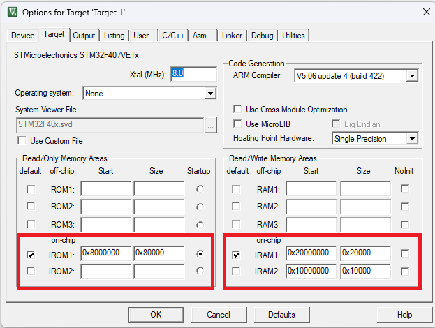

# Simple Experimental Real-Time Operating System (SERTOS) 
### RTOS example on ARM cortex M4 CPU architecture

This repo contains SERTOS, an experimental OS kernel which is currently under development and is tested on ARM cortex M4 CPU architecture based MCU (STM32F407). The OS kernel software is mix of ARM assembly (for ARM cortex M4 CPU) and C programming languages. The section [References](#references) contains the resources referred during development of this operating systems.

The project contains the SERTOS OS kernel software files in the folder <i>\<project>/SERTOS</i> a test user application <i>\<project>/user_app.c</i>. The OS software contains source code files for kernel components like task management and context switch mechanism (Improvements and other components will be researched in future upgrades). The user  application has three tasks named `task_a`, `task _b` and `task_c`. In all the tasks, a counter variable is increased. Also each task turns ON a LED corresponding to it while keeping other LEDs OFF. Step-by-step debugging can be used to observe the working of the OS components like Context switching.

The CE assumes the configuration of memory regions RAM and ROM for vector table placement is done by the user. It can be done through either Linker script or the IDE's settings like `"options for target..."` in Keil IDE.

The memory configuration (ROM , RAM) used in this example is as shown below. Keil IDEs `"options for target..."` was used for the same. Tested with ARM compiler only.

**Figure 1: Memory configuration (ROM , RAM)**

## Software (SW) Setup
- Tested with Keil uvision4 IDE: V5.22.0.0 (MDK522)
    - Device pack for STM32F407 in keil: STM32F4xx_DFP Version 2.14.0 (2019-07-24)
- Arm® Compiler V5.06

## Hardware (HW) setup
- <b>MCU used</b>: STM32F407
- <b>Development Board</b>: STM32 Black board with STM32F407VET6 onboard
- ST-Link utility HW for program code download to STM32 MCU

## Operation

Build and program the code into STM32 MCU, do step-by-step debugging to observe the working of the OS. Upon start of the program, the three LEDs will start blinking based on the current tsak being executed. 

## Concept

This project is an example of a Real-Time Operating System (RTOS) and intends to explore the various concepts involved in the design working of an OS like - concept of Threads/processes, Scheduling, Memory Management, Inter-Process Communication. Currently it implements only a simple round-robin scheduler, with a pre-specified time slice which is same for all the tasks.

<b>Thread Creation -</b> 
The program starts by initializing the thread's TCBs (Task Control Block), stacks and other important pointers for creating a list of TCBs for scheduling/context switching. The Systick timer of the MCU is used for context switching and the timer is initialized before the start of the OS.

<b>OS start -</b> 
The start of the OS is done through `sertos_start_os` function, which is an assembly routine and uses ARM cortex-M4 CPU architecture instruction set. This function launches the OS by starting the first task using a branch instruction, enables the global interrupts so the systick IRQ can be handled. This function makes it look like the context of the first task has already been pushed into it's TCB's stack and now we are just restoring it to CPU registers, just like the context switch function. Initially before the OS launch all the TCB's stacks will have dummy data.

<b>context switching -</b> 
The systick timer is used for the context switching for simplicity reasons, there are more reasons to use the PendSV/SVC for context switching but this will be evaluated in the future updates.

Upon every systick IRQ trigger, the context switching is carried out in the following way -

1. The IRQ mechanism of ARM CM4 CPU itself saves the following CPU registers onto the current task TCB's stack in the following order: The values of the `xPSR`, `return address (PC)`, `Link register (R14)`, `R12`, `R0-R3`.

2. The Global interrupts are disabled, so as to avoid another high priority interrupt occur during this operation.

3. The Systick ISR saves the CPU registers `R4 to R11` into current task TCB's stack using the `PUSH` operation. This operation uses the stack pointer of the current task's TCB.

4. The value of CPU register `SP` is copied to current task TCB's stack pointer field. This CPU register `SP` would be pointing to some index of the current task TCB's stack.

5. The current thread pointer pointing to current task is made to point to the next task about to resume, this task will be referred to as "switched task" till the context switch completes. After the ISR completes, the CPU will start executing this switched task.

6. The value of the stack pointer of the switched task's TCB is copied into the CPU register `SP`.

7. The value of the registers of switched TCB stack is saved into the CPU registers using the `POP` operation. This operation uses the stack pointer of the switched task's TCB mentioned in the previous step.

8. Global interrupts are enabled.

9. Systick ISR returns using the CPU's internal ISR return mechanism involving the `Link register (LR)`.

## References
- Jonathon Volvano's Texas University Courses and Book
    - [University of Texas, Embedded and Real-Time Systems/Real-Time Operating Systems](https://users.ece.utexas.edu/~gerstl/ee445m_s20/index.html)
    - [University of Texas, Embbedded systems companion website -](https://users.ece.utexas.edu/~valvano/)
        - Contains Example projects and other reference materials

  
---------------------------------------------------------
## Warning
The Software(s) assosciated and referred to in this repo, authored by ayushjain141 (Email: mr.ayush141@gmail.com) is intended to work in laboratory conditions only and are not tested for any security, safety and hazardous environment applications and is not intended to be used in any such cases. The referred software does not guarantee correct working in any safety-critical systems and in medical devices, the software should be used completely at user's risk only. In case of any form of failure or circumstances arising upon usage of this software the user is the only liable party and the author is not at all liable in any case. The referred software is liable to change without any notice to anyone and the author is not at all liable in any circusmtances arising because of these changes. For this or assosciated software, hardware and documents - any commercial logos, trademarks, copyrights, names and brands may be claimed as property of their respective owners.
